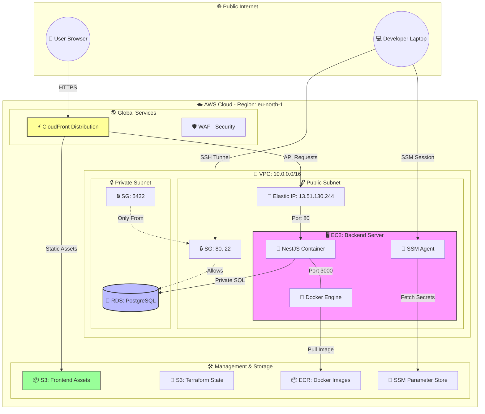

# Cloud Architecture - Shopyhub

This document describes the cloud infrastructure for the Shopyhub e-commerce application.

## Infrastructure Diagram



## Component Breakdown

### 1. Networking (VPC)
- **VPC**: 10.0.0.0/16 isolated network.
- **Public Subnet**: Contains the EC2 instance and Internet Gateway.
- **Private Subnet**: Contains the RDS database (no direct internet access).

### 2. Frontend (Static)
- **S3 Bucket**: Stores the built React/Vite assets.
- **CloudFront**: Serves assets with low latency via edge locations.

### 3. Backend (Compute)
- **EC2 Instance**: Amazon Linux 2023 running Docker.
- **Docker**: Hosts the NestJS API container.
- **Elastic IP**: Provides a stable entry point for the CloudFront origin.

### 4. Database (Storage)
- **RDS PostgreSQL**: Managed database service.
- **Security**: Only accessible from the Backend Security Group.

### 5. Management & CI/CD
- **SSM Parameter Store**: Secure storage for all environment variables and the SSH Private Key.
- **ECR**: Private registry for application Docker images.
- **GitHub Actions**: Automates Terraform applies and application deployments.

## Secure Access Instructions

### SSH Access
Retrieve the private key from SSM and connect:
```bash
aws ssm get-parameter --name "/potw-prod/SSH_PRIVATE_KEY" --region eu-north-1 --with-decryption --query "Parameter.Value" --output text > backend-key.pem
chmod 400 backend-key.pem
ssh -i backend-key.pem ec2-user@13.51.130.244
```

### Database Tunneling
Access the private RDS from your local machine:
```bash
ssh -i backend-key.pem -L 5433:<RDS_ENDPOINT>:5432 -N ec2-user@13.51.130.244
```
