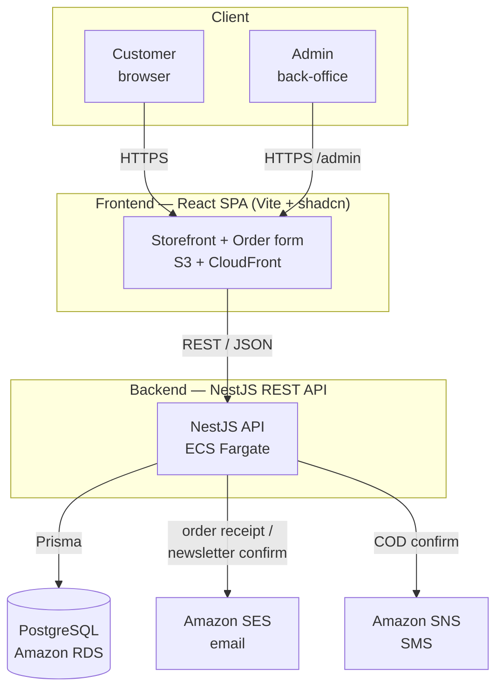
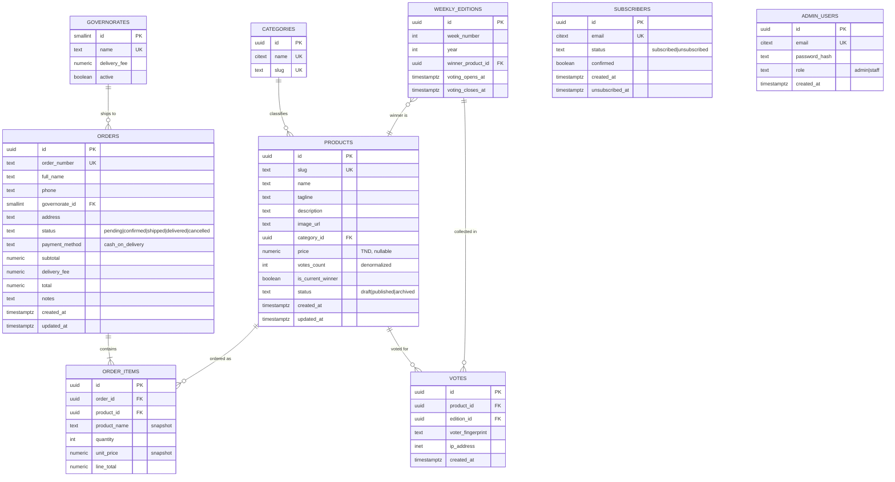
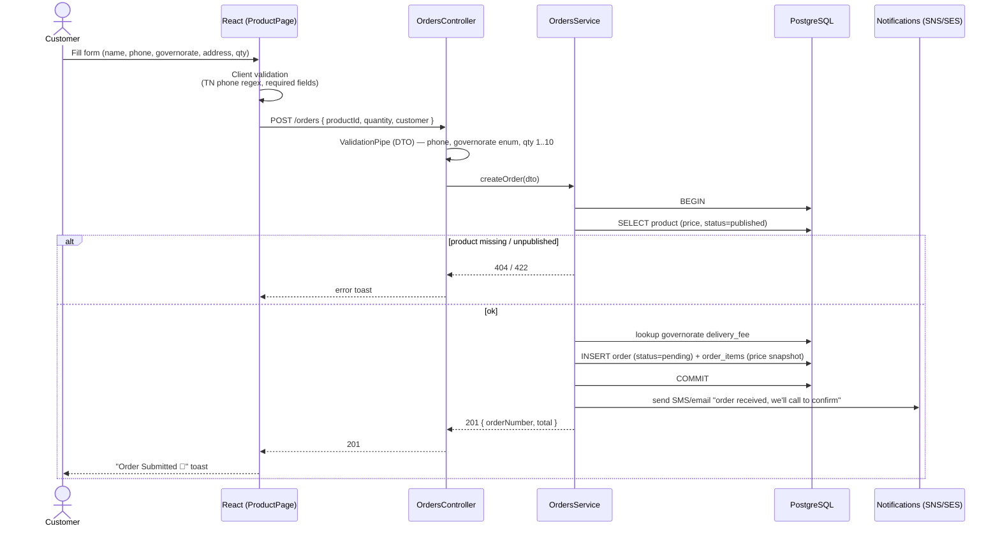
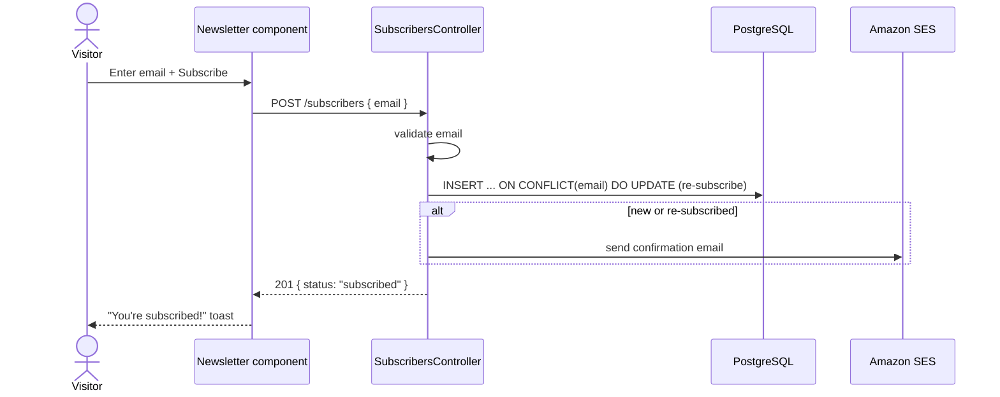
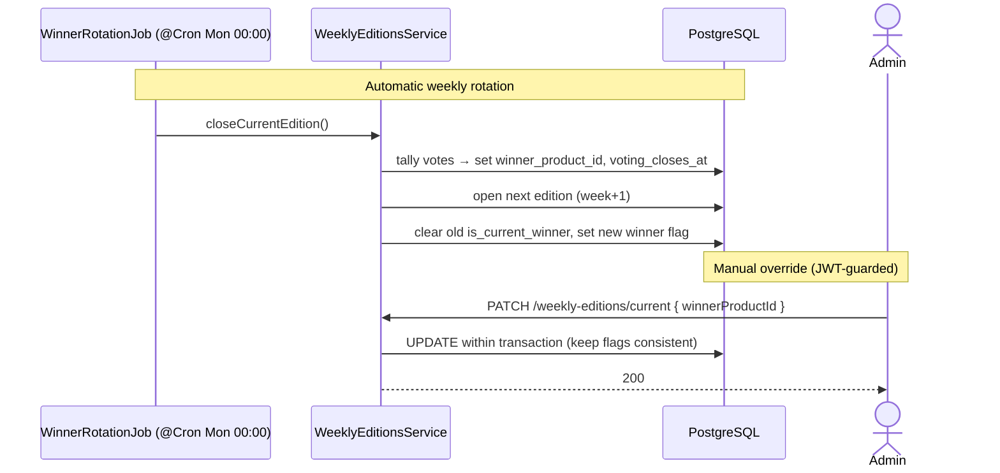
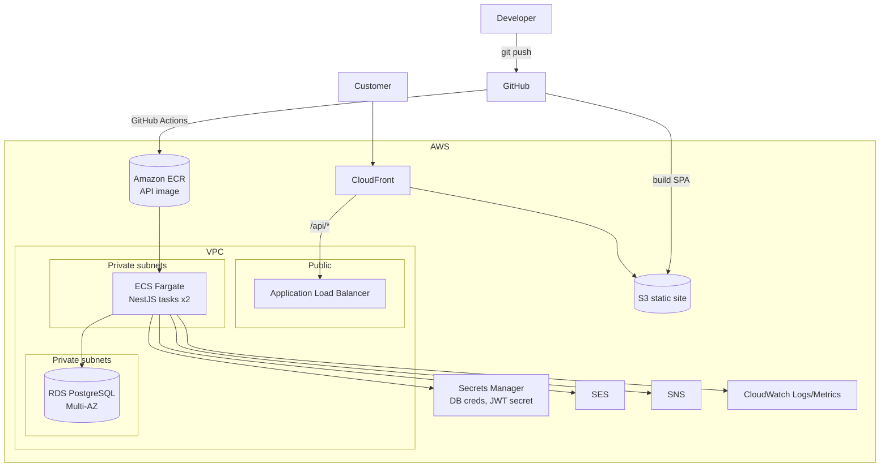

# Architecture & Diagrams

All diagrams are [Mermaid](https://mermaid.js.org/) — they render on GitHub and in
the VS Code Mermaid preview.

---

## 1. System context



---

## 2. Component / layered architecture (NestJS)

```mermaid
flowchart LR
    subgraph HTTP
        C1[ProductsController]
        C2[OrdersController]
        C3[VotesController]
        C4[SubscribersController]
        C5[WeeklyEditionsController]
        C6[ReferenceController]
        C7[AuthController]
    end

    subgraph Services["Business logic (Services)"]
        S1[ProductsService]
        S2[OrdersService]
        S3[VotesService]
        S4[SubscribersService]
        S5[WeeklyEditionsService]
        S6[ReferenceService]
        S7[AuthService]
    end

    subgraph Cross["Cross-cutting"]
        G[JwtAuthGuard / RolesGuard]
        V[ValidationPipe<br/>class-validator DTOs]
        F[AllExceptionsFilter]
        N[NotificationsService<br/>SES + SNS]
        SCH[WinnerRotationJob<br/>@Cron weekly]
    end

    P[(PrismaService)]
    DB[(PostgreSQL)]

    C1 --> S1
    C2 --> S2
    C3 --> S3
    C4 --> S4
    C5 --> S5
    C6 --> S6
    C7 --> S7

    S1 --> P
    S2 --> P
    S2 --> N
    S3 --> P
    S4 --> P
    S4 --> N
    S5 --> P
    S6 --> P
    S7 --> P
    SCH --> S5
    P --> DB

    G -.guards.-> C2
    G -.guards.-> C5
    V -.validates.-> HTTP
    F -.formats errors.-> HTTP
```

> **Public** endpoints: products (read), orders (create), votes, subscribers,
> reference, current weekly edition.
> **Admin (JWT-guarded)**: product writes, order management, weekly-edition
> writes, subscriber export.

---

## 3. Entity-Relationship diagram



**Modeling notes**
- `order_items` **snapshots** `product_name` and `unit_price` so historical
  orders stay correct even if the product price changes later.
- `products.votes_count` is **denormalized** for fast reads; the source of truth
  is the `votes` table (one row per vote). A unique index on
  `(edition_id, voter_fingerprint)` enforces one vote per voter per week.
- "Current winner" is expressed two ways that must stay consistent:
  `weekly_editions.winner_product_id` (authoritative, historical) and
  `products.is_current_winner` (a convenience flag; a **partial unique index**
  guarantees at most one `TRUE`).
- The order form is single-product today, but `order_items` keeps the model
  cart-ready with zero schema change.

---

## 4. Sequence — Place a COD order



---

## 5. Sequence — Newsletter subscribe



---

## 6. Sequence — Admin: rotate weekly winner



---

## 7. Deployment (Terraform → AWS)



**Terraform modules** (to place in the repo's `terraform/`):
`network` (VPC, subnets, NAT) · `database` (RDS + subnet group + SG) ·
`api` (ECR, ECS cluster/service/task, ALB, target group, autoscaling) ·
`frontend` (S3 + CloudFront + ACM cert) · `secrets` · `iam`.

---

## 8. Key decisions (ADR-style summary)

| # | Decision | Rationale | Trade-off |
|---|----------|-----------|-----------|
| 1 | NestJS + Prisma + Postgres | Type sharing with FE, transactional COD flow, mature ecosystem | Heavier than BaaS |
| 2 | Guest checkout (no customer accounts) | Form collects only name/phone/address; COD needs no login | No order history per user (lookup by phone/order number instead) |
| 3 | `order_items` with price snapshot | Historical accuracy + future cart support | Slightly more joins |
| 4 | `weekly_editions` entity | Clean "Product of the Week" rotation + per-week voting | One extra table vs. a flag-only approach |
| 5 | Governorate lookup table (not enum) | Carries per-zone `delivery_fee`, editable without migration | Needs a seed |
| 6 | Denormalized `votes_count` | Fast storefront reads | Must update on each vote (handled in service/trigger) |
| 7 | Fargate over Lambda | Long-lived service, scheduled jobs, simpler transactions | Always-on baseline cost |
